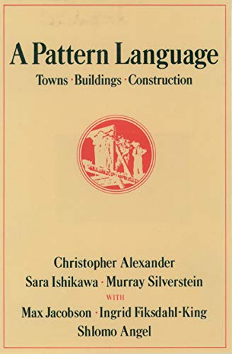
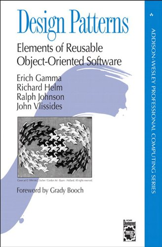

# Objetivo da Aula
 - Definição
 - Tipos
 - Patterns mais utilizados
 ---------------------------------------------------------
 ## _Definição_

 Design Patterns ou padrões de projetos são soluções generalistas para problemas recorrentes durante o desenvolvimento de um software. Não se trata de um framework ou um código pronto, mas de uma definição de alto nível de como um problema comum pode ser solucionado.

### ___A Pattern Language___

- Surgiu em 1978
- Christopher Alexander, Sara  Ishikawa e Murray Silverstein
- 253 tipos de problemas/desafios de projetos

### ___Formato de um Pattern___
 - Nome
 - Exemplo ( de sua utlização )
 - Contexto ( que pode ser aplicado )
 - Problema ( que o pattern resolve )
 - Solução ( a forma que ele resolve )

 ### ___Using Pattern Languages for Object-Oriented Programs___

  - 1987
  - Kent Beck e Ward Cunningham
  - 5 Padões de projetos
### ___Design Patterns: Elements of Reusable Object-Oriented Software___

 - 1994
 - Gang of four (GoF)
 - Erich Gamma, Richard Helm, Ralph Johnson e John Vlissides 

  

 -------------------------------------------------------

## _Tipos_

 - Criação
 - Estruturais
 - Comportamentais

 ### ___Padrões de Criação___

 Os padrões de criação são aqueles que abstraem e/ou adiam o processo de criação dos objetos. Eles ajudam a tornar um sistema independente de como seus objetos são criados, compostos e representados.

- Abstract Factory
- Builder
- Factory method
- Prototype
- Singleton

### ___Padrões Estruturais___

Os padrões estruturais se preocupam com a forma de como classes e objetos são compostos para formar estruturas maiores.

 - Adapter
 - Bridge
 - Composite
 - Decorator
 - Facade
 - Business Delegate
 - Flyweight
 - Proxy

 ### ___Padrões Comportamentais___

 Os padrões de comportamentos se concentram nos algoritmos e atribuições de responsabilidades entre os objetos. Eles não descrevem apenas padrões de objetos ou de classes, mas também padrões de comunicações entre objetos.

 - Chain of Responsibility
 - Command
 - Interpreter
 - Iterator
 - Mediator 
 - Observer 
 - State
 - Strategy
 - Template method
 - Visitor

 ---------------------------------------------------------

## _Patterns mais utilizados_

 - Factory
 - Singleton
 - Decorator
 - Observer
 - Module

 ### ___Factory___

 Todas as funções que retornam um objeto, sem a necessidade de chama-las com o `new`, são consideradas funções ___Factory___ (fábrica).

Exemplo do que ___não___ é uma função Factory:
 ~~~javascript
 function FakeUser() {
     this.name: 'Willames'
     this.lastName: 'Santos'
 }

 // não é Factory
 const user = new FakeUser()
 ~~~

Exemplo de Factory:
 ~~~javascript
 function FakeUser() {
     return {
        name: 'Willames'
        lastName: 'Santos'
     }
     
 }

 // Factory
 const user = FakeUser()
 ~~~

### ___Singleton___

O objetivo desse pattern é criar uma única instância de uma função construtora e retorná-la toda vez em que for necessário utilizá-la.

O [___jQuery___](https://jquery.com/) use o padrão de Singleton.

Exemplos de Singleton:

- Pode ser uma variável global
~~~javascript
var SETTINGS ={
    api: 'http://localhost',
    trackJsToken: '12345'
}
~~~

- Em função, caso a variável não esteja definida ele instância

~~~javascript
function MyApp() {
    if(!MyApp.instance) {
        MyApp.instance = this
    }
    return MyApp.instance
}
~~~
### ___Decorator___

Uma função decorator recebe uma outra função como parâmetro e estende o seu comportamento sem modificá-la explicitamente.

 - [Proposta](https://github.com/tc39/proposal-decorators)
 - [TypeScript](https://www.typescriptlang.org/docs/handbook/decorators.html)

 Exemplo usando a sintaxe decorator:
 ~~~javascript
 function readonly(target, name, descriptor) {
     descriptor.writable = false
     return descriptor
 }

 class Job {
     @readonly
     title() { return 'CEO' }
 }
 ~~~

 Exemplo de dacorator no Angular:

 ~~~javascript
 @Component({
     selector: 'app-reactive-favorite-color',
     template: `
        Favorite Color: <input type="text" [formControl]="favoriteColorControl">
    `
 })

 export class FavoriteColorComponent{
     favoriteColorControl = new FormControl('')
 }

~~~
### ___Observer___

É um pattern muito popular em JavaScript. A instância (subscriber) mantém uma coleção de objetos (observers) e notifica todos eles quando ocorrem mudanças no estado.

- [Vue](https://github.com/vuejs/vue/blob/dev/src/core/observer/index.js#L229)
- [RxJs](https://rxjs-dev.firebaseapp.com/guide/observable)

Exemplo de observer:

~~~javascript
class Observable {
    constructor() {
        this.observers = []
    }

    subscribe(f) {
        this.observers.push(f)
    }

    unsubscribe(f) {
        this.observers = this.observers.filter(subscriber => !== f )
    }

    notify(data){
        this.observers.forEach(observer => observer(data))
    }
}
~~~
### ___Module___

É um pattern que possibilita organizarmos melhor o nosso código, sem a necessidade de expor variáveis globais.

Exemplo de module: 
~~~javascript
class Person {
    constructo(name) {
        this.name = name
    }
}

export default Person

// Utilizar Person
import Person from './models/person'
~~~
